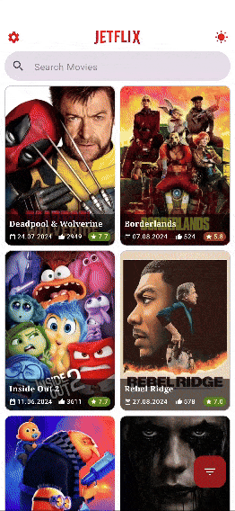
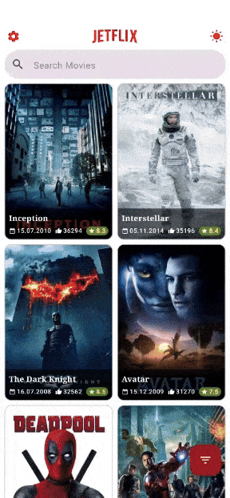

<h1 align="center">Jetflix</h1>
<h4 align="center">Movie listing app that demonstrates various UI's written with Jetpack Compose using TheMovieDb API</h4>

 

## Screenshots

## Download

Go to [Play Store](https://play.google.com/store/apps/details?id=com.yasinkacmaz.jetflix) to download the latest APP.

Go to [Releases](https://github.com/yasinkacmaz/jetflix/releases) page to download the latest APK.

## Technologies

- [Kotlin](https://kotlinlang.org/) - %100 Kotlin
- [Jetpack Compose](https://developer.android.com/jetpack/compose) for Declarative UI
- [Accompanist](https://github.com/google/accompanist) for Compose UI Widgets
- [Coil](https://github.com/coil-kt/coil) for image loading
- [Coroutines](https://github.com/Kotlin/kotlinx.coroutines) for asynchronous operations
- [StateFlow](https://kotlin.github.io/kotlinx.coroutines/kotlinx-coroutines-core/kotlinx.coroutines.flow/-state-flow/)
- [ViewModel](https://developer.android.com/topic/libraries/architecture/viewmodel)
- [Dagger Hilt](https://developer.android.com/training/dependency-injection/hilt-android) for Dependency Injection
- [OkHttp](https://github.com/square/okhttp) and [Ktor](https://github.com/ktorio/ktor) for network operations
- [TheMovieDb(Tmdb) Api](https://developers.themoviedb.org/3) for movies
